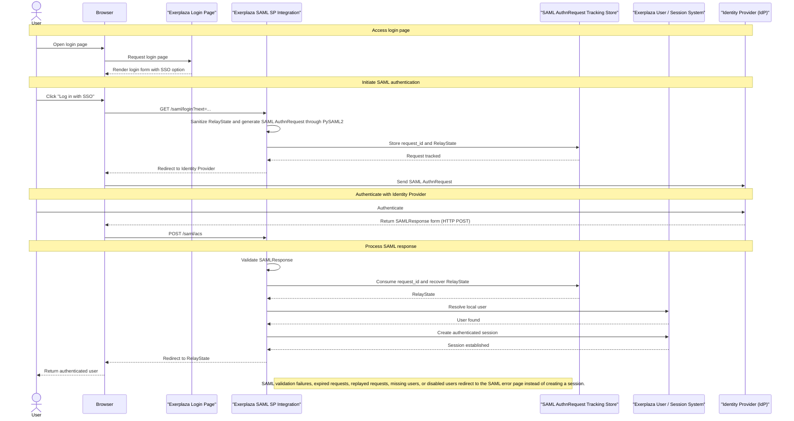
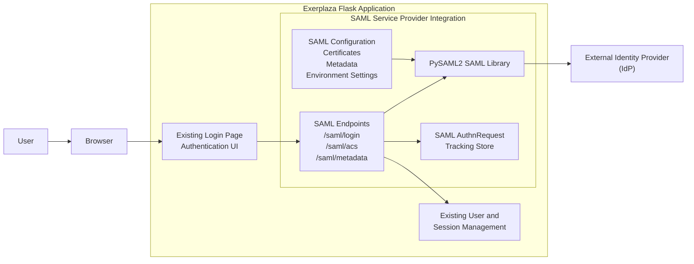

# Documentation

## Overview

This module introduces SAML-based Single Sign-On authentication capabilities into Exerplaza.

The implementation acts as a SAML Service Provider (SP) integrated directly into the existing Flask application using PySAML2. It allows users to authenticate through an external Identity Provider (IdP) while integrating with the existing user management and session mechanisms. The SAML login flow is exposed through the existing login page by adding an additional entry point that redirects users to the SAML authentication endpoint.

The current implementation provides:

- SAML authentication through a configured Identity Provider  
- Service Provider metadata generation  
- SAML authentication request generation  
- Assertion Consumer Service (ACS) processing  
- Integration with the existing user session management  
- Database-backed SAML authentication request lifecycle tracking  
- Replay protection mechanisms through single-use request consumption and expiration validation  
- Local certificate generation and SAML environment setup utilities for testing and deployment preparation

The implementation currently supports a single configured Identity Provider and represents a complete authentication flow implementation within the supported project scope.

The SAML integration uses static configuration for the lifetime of a running application process. Environment settings and configuration paths are resolved during application startup. Basic startup validation is also performed at that stage. SAML-specific validation and PySAML2 Service Provider initialization occur when the SAML Service Provider is initialized. Once initialized, the Service Provider configuration is cached and remains static until the application restarts.

## Current limitations

The current implementation demonstrates the complete authentication flow implementation within the supported project scopes as a functional basis for further production validation. Before production use, additional validation and hardening would be required, including:

- Additional security hardening and review  
- Extended handling of edge cases and failure scenarios  
- Validation against the target production Identity Provider environment  
- Additional deployment-specific testing and operational validation  

The current implementation is designed around a single configured Identity Provider. Support for multiple Identity Providers or federation scenarios is not included in the current scope.

The current implementation does not provision or update users from SAML assertions. After a successful SAML authentication, Exerplaza resolves the user exclusively by email address against the existing internal user database. Authentication succeeds only if a matching local user already exists and is allowed to log in.

Time-based SAML assertion validation, including clock-related validity checks handled by the underlying SAML library, is not customized by the Exerplaza application layer in the current implementation.

Expired and unused authentication requests can be removed through the provided cleanup operation. The database does not automatically remove expired records; cleanup must be triggered by an external maintenance process or scheduled task.

## SAML Authentication Architecture 

The SAML authentication implementation introduces a Service Provider (SP) integration inside the existing Exerplaza Flask application. The integration extends the existing authentication flow by adding an external Identity Provider (IdP) authentication option while preserving the existing user and session management mechanisms.

The architecture consists of the following components:

- The existing Exerplaza authentication UI, which provides the entry point for SAML login.  
- The SAML Service Provider integration, which handles SAML endpoints and authentication flow coordination.  
- PySAML2, which provides SAML protocol handling and Service Provider functionality.  
- A database-backed AuthnRequest tracking store, which maintains authentication transaction state and provides replay protection.  
- The existing Exerplaza user and session management system, which remains responsible for application authentication state.  
- An external Identity Provider, which performs user authentication and returns SAML assertions.  

## SAML Authentication Flow

---

---
