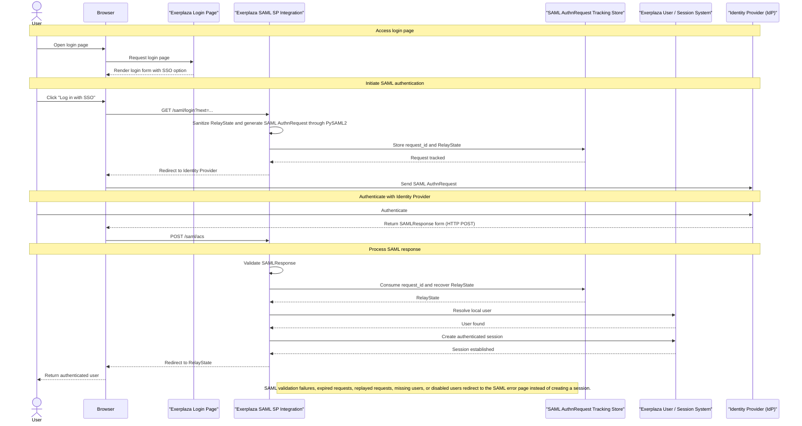
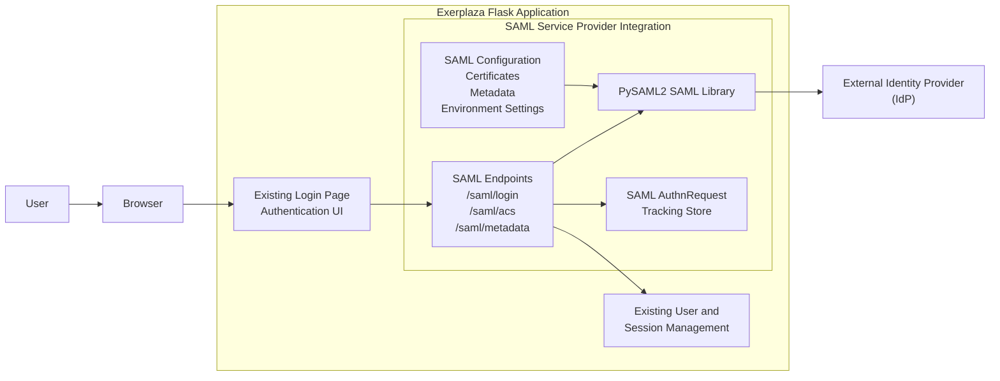

## SAML Authentication Architecture 

The SAML authentication implementation introduces a Service Provider (SP) integration inside the existing Exerplaza Flask application. The integration extends the existing authentication flow by adding an external Identity Provider (IdP) authentication option while preserving the existing user and session management mechanisms.

The architecture consists of the following components:

- The existing Exerplaza authentication UI, which provides the entry point for SAML login.  
- The SAML Service Provider integration, which handles SAML endpoints and authentication flow coordination.  
- PySAML2, which provides SAML protocol handling and Service Provider functionality.  
- A database-backed AuthnRequest tracking store, which maintains authentication transaction state and provides replay protection.  
- The existing Exerplaza user and session management system, which remains responsible for application authentication state.  
- An external Identity Provider, which performs user authentication and returns SAML assertions.  

## SAML Authentication Flow

---

---
