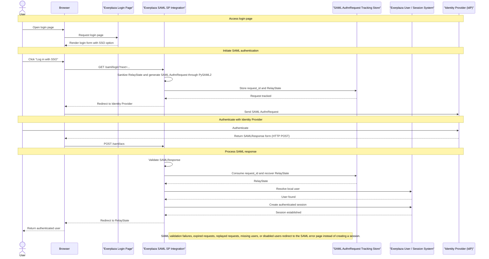
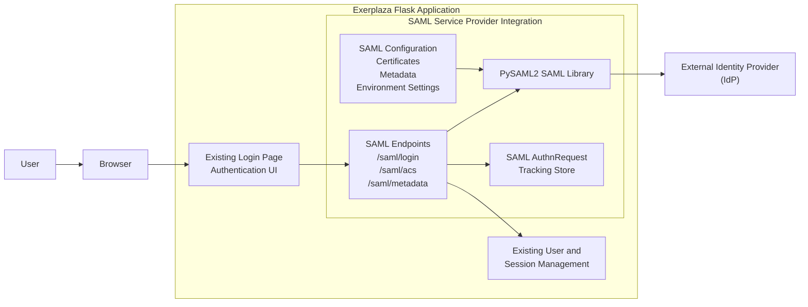

# Documentation

## Overview

This module introduces SAML-based Single Sign-On authentication capabilities into Exerplaza.

The implementation acts as a SAML Service Provider (SP) integrated directly into the existing Flask application using PySAML2. It allows users to authenticate through an external Identity Provider (IdP) while integrating with the existing user management and session mechanisms. The SAML login flow is exposed through the existing login page by adding an additional entry point that redirects users to the SAML authentication endpoint.

The current implementation provides:

- SAML authentication through a configured Identity Provider  
- Service Provider metadata generation  
- SAML authentication request generation  
- Assertion Consumer Service (ACS) processing  
- Integration with the existing user session management  
- Database-backed SAML authentication request lifecycle tracking  
- Replay protection mechanisms through single-use request consumption and expiration validation  
- Local certificate generation and SAML environment setup utilities for testing and deployment configuration  

The implementation currently supports a single configured Identity Provider and represents a complete SAML authentication flow integration within the current project scope.

The SAML configuration is loaded during application startup and is considered static during runtime. This ensures that all application workers operate using a consistent Service Provider configuration. Any changes to the SAML configuration require rebuilding or restarting the application environment.

## Current limitations

The current implementation demonstrates the complete SAML authentication flow and provides a functional basis for further production validation. Before production use, additional validation and hardening would be required, including:

- Additional security hardening and review  
- Extended handling of edge cases and failure scenarios  
- Validation against the target production Identity Provider environment  
- Additional deployment-specific testing and operational validation  

The current implementation is designed around a single configured Identity Provider. Support for multiple Identity Providers or federation scenarios is not included in the current scope.

Expired and unused authentication requests can be removed through the provided cleanup operation. The database does not automatically remove expired records; cleanup must be triggered by an external maintenance process or scheduled task.

## SAML Authentication Architecture and Flow

The SAML authentication implementation introduces a Service Provider (SP) integration inside the existing Exerplaza Flask application. The integration extends the existing authentication flow by adding an external Identity Provider (IdP) authentication option while preserving the existing user and session management mechanisms.

The architecture consists of the following components:

- The existing Exerplaza authentication UI, which provides the entry point for SAML login.  
- The SAML Service Provider integration, which handles SAML endpoints and authentication flow coordination.  
- PySAML2, which provides SAML protocol handling and Service Provider functionality.  
- A database-backed AuthnRequest tracking store, which maintains authentication transaction state and provides replay protection.  
- The existing Exerplaza user and session management system, which remains responsible for application authentication state.  
- An external Identity Provider, which performs user authentication and returns SAML assertions.  

## SAML Authentication Architecture and Flow


---


---

## Components

### Flask Application

The Flask application remains responsible for:

- handling HTTP requests;
- managing application sessions;
- integrating the authenticated user into the existing application flow.

The SAML authentication system is integrated as an additional authentication mechanism without replacing the existing authentication logic.

---

### PySAML2

PySAML2 provides the core SAML functionality.

It is responsible for:

- creating SAML authentication requests;
- processing SAML responses;
- communicating with Identity Providers;
- handling SAML protocol operations.

---

### Identity Provider

The Identity Provider is responsible for:

- authenticating users;
- generating SAML responses;
- providing user identity information.

During development and testing, Keycloak was used as a local Identity Provider.

---

### SAML Request Tracking Database

The implementation includes a database-backed request tracking system.

This component is responsible for:

- storing active authentication requests;
- validating incoming SAML responses;
- maintaining state across multiple application workers;
- preventing reuse of completed authentication requests.

---

# Authentication Flow

## 1. Login request

When a user chooses SAML authentication:

1. The user accesses the SAML login endpoint.
2. Exerplaza generates a SAML authentication request.
3. The request information is stored in the database.
4. The user is redirected to the Identity Provider.

The stored information allows Exerplaza to later validate that the returned response corresponds to an existing authentication transaction.

---

## 2. Identity Provider authentication

The Identity Provider:

1. receives the SAML authentication request;
2. authenticates the user;
3. generates a SAML response;
4. redirects the response back to Exerplaza.

---

## 3. SAML response validation

When Exerplaza receives the SAML response:

1. The request identifier is extracted.
2. The corresponding authentication request is searched in the database.
3. The request expiration is checked.
4. The request usage status is checked.
5. The response is accepted or rejected.

A request can only be successfully consumed once.

---

## 4. Application session creation

After successful SAML validation:

1. The authenticated user information is processed.
2. The user is integrated into the existing Exerplaza authentication flow.
3. A normal application session is created.

The existing authentication system remains unchanged.

---

# Project Structure

The implementation is divided into separate modules according to responsibility.

Example structure:

```
saml/
|
├── routes/
│   └── Authentication endpoints
│
├── services/
│   └── SAML protocol logic
│
├── configuration/
│   └── SAML configuration management
│
├── templates/
│   └── Authentication error pages
│
└── database/
    └── Request tracking models
```

## Routes

Responsible for:

- starting authentication;
- receiving SAML responses;
- handling authentication errors.

---

## Services

Responsible for:

- interacting with PySAML2;
- creating and validating SAML messages;
- implementing authentication logic.

---

## Configuration

Responsible for:

- loading SAML settings;
- reading environment variables;
- generating PySAML2 configuration objects.

---

## Database

Responsible for:

- storing authentication request information;
- validating request lifecycle;
- preventing request reuse.

---

# Configuration

The SAML integration requires several configuration parameters.

These include:

## Service Provider information

Defines Exerplaza as a SAML Service Provider.

Examples:

- entity identifier;
- assertion consumer service URL;
- certificates.

---

## Identity Provider information

Defines the external authentication provider.

Examples:

- IdP metadata;
- entity identifier;
- certificates;
- endpoints.

---

## Environment variables

SAML-related settings are loaded through environment variables.

The required variables depend on the deployment environment.

Example:

```
SAML_ENTITY_ID=
SAML_ACS_URL=
SAML_METADATA_PATH=
SAML_CERT_PATH=
SAML_KEY_PATH=
```

---

# Security Considerations

## Persistent request tracking

The default PySAML2 request state handling relies on temporary internal storage.

This approach was not suitable for the Exerplaza deployment environment because multiple uWSGI workers may process different parts of the same authentication transaction.

To solve this issue, authentication requests are stored in the application database.

---

## Replay protection

Each SAML authentication request is associated with:

- a unique identifier;
- an expiration time;
- a consumption status.

A previously completed request cannot be reused.

---

## Validation

The implementation includes tests covering:

- invalid authentication responses;
- expired requests;
- invalid sessions;
- disabled users;
- unsafe redirects;
- authentication failures.

---

# Testing

## Automated tests

The implementation includes automated tests covering different parts of the authentication flow.

Tests include:

### Component tests

Validate individual components such as:

- configuration loading;
- route behaviour;
- helper functions.

---

### Behavioural tests

Validate interactions between components:

- request creation;
- database tracking;
- response validation;
- authentication flow behaviour.

---

## End-to-end testing

The complete authentication flow was tested using a local Keycloak Identity Provider.

The test validates:

1. Starting authentication.
2. Redirecting to the Identity Provider.
3. Completing authentication.
4. Returning the SAML response.
5. Validating the response.
6. Creating the application session.

---

# Setup

## Requirements

Before running the SAML integration, ensure that:

- the project environment is correctly configured;
- required dependencies are installed;
- database migrations are applied;
- certificates are generated.

---

## Identity Provider setup

A local Identity Provider can be configured using Keycloak.

The IdP must provide:

- metadata;
- authentication endpoints;
- certificates;
- user attributes.

---

## Certificates

The implementation requires certificates for SAML communication.

Generation and validation scripts are provided to simplify certificate management.

---

# Limitations

The current implementation is a functional prototype.

Known limitations:

- only one Identity Provider has been tested;
- production deployment requires additional validation;
- federation scenarios require further testing;
- a complete production security review has not been performed.

---

# Future Improvements

Possible future extensions include:

- support for multiple Identity Providers;
- federation discovery support;
- additional security testing;
- production deployment validation;
- improved monitoring and logging.

---

# Maintenance Notes

When modifying the SAML implementation, particular attention should be given to:

- request tracking logic;
- certificate management;
- Identity Provider configuration;
- authentication state handling.

Changes to these components should always be validated through automated tests and end-to-end authentication testing.
