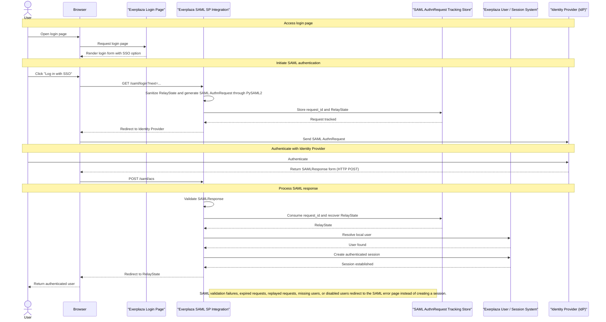
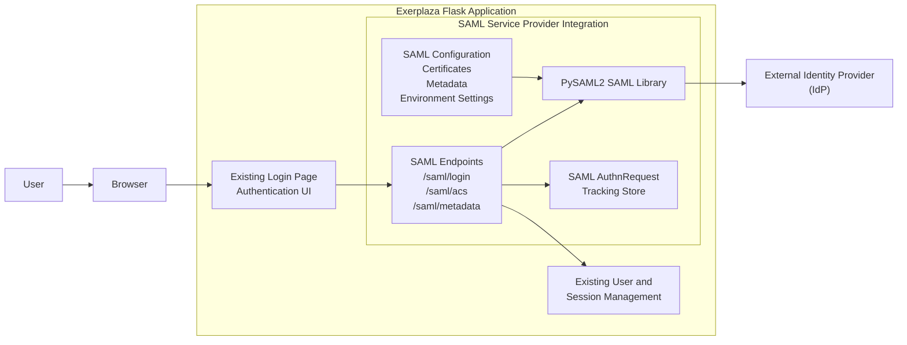

# Documentation

## Overview

This module introduces SAML-based Single Sign-On authentication capabilities into Exerplaza.

The implementation acts as a SAML Service Provider (SP) integrated directly into the existing Flask application using PySAML2. It allows users to authenticate through an external Identity Provider (IdP) while integrating with the existing user management and session mechanisms. The SAML login flow is exposed through the existing login page by adding an additional entry point that redirects users to the SAML authentication endpoint.

The current implementation provides:

- SAML authentication through a configured Identity Provider  
- Service Provider metadata generation  
- SAML authentication request generation  
- Assertion Consumer Service (ACS) processing  
- Integration with the existing user session management  
- Database-backed SAML authentication request lifecycle tracking  
- Replay protection mechanisms through single-use request consumption and expiration validation  
- Local certificate generation and SAML environment setup utilities for testing and deployment configuration  

The implementation currently supports a single configured Identity Provider and represents a complete SAML authentication flow integration within the current project scope.

The SAML integration uses static configuration for the lifetime of a running application process. Environment settings and configuration paths are resolved during application startup. Basic startup validation is also performed at that stage. SAML-specific validation and PySAML2 Service Provider initialization occur when the SAML Service Provider is initialized. Once initialized, the Service Provider configuration is cached and remains static until the application restarts.

## Current limitations

The current implementation demonstrates the complete SAML authentication flow and provides a functional basis for further production validation. Before production use, additional validation and hardening would be required, including:

- Additional security hardening and review  
- Extended handling of edge cases and failure scenarios  
- Validation against the target production Identity Provider environment  
- Additional deployment-specific testing and operational validation  

The current implementation is designed around a single configured Identity Provider. Support for multiple Identity Providers or federation scenarios is not included in the current scope.

The current implementation does not provision or update users from SAML assertions. After a successful SAML authentication, Exerplaza resolves the user exclusively by email address against the existing internal user database. Authentication succeeds only if a matching local user already exists and is allowed to log in.

Time-based SAML assertion validation, including clock-related validity checks handled by the underlying SAML library, is not customized by the Exerplaza application layer in the current implementation.

Expired and unused authentication requests can be removed through the provided cleanup operation. The database does not automatically remove expired records; cleanup must be triggered by an external maintenance process or scheduled task.

## SAML Authentication Architecture 

The SAML authentication implementation introduces a Service Provider (SP) integration inside the existing Exerplaza Flask application. The integration extends the existing authentication flow by adding an external Identity Provider (IdP) authentication option while preserving the existing user and session management mechanisms.

The architecture consists of the following components:

- The existing Exerplaza authentication UI, which provides the entry point for SAML login.  
- The SAML Service Provider integration, which handles SAML endpoints and authentication flow coordination.  
- PySAML2, which provides SAML protocol handling and Service Provider functionality.  
- A database-backed AuthnRequest tracking store, which maintains authentication transaction state and provides replay protection.  
- The existing Exerplaza user and session management system, which remains responsible for application authentication state.  
- An external Identity Provider, which performs user authentication and returns SAML assertions.  

## SAML Authentication Flow


---


---

## Components

The SAML integration is composed of several components that work together to provide Service Provider functionality while integrating with the existing Exerplaza authentication system.

### mod_saml SAML Service Provider Integration

The `mod_saml` module acts as the application-level integration layer for SAML authentication inside Exerplaza.

It provides the Flask-based Service Provider functionality and coordinates the authentication flow between the existing application, PySAML2, the Identity Provider, and the existing user/session system.

It integrates:

- Flask SAML endpoints  
- PySAML2 protocol handling  
- AuthnRequest tracking  
- Existing user/session integration  

Responsibilities:

- Expose SAML-related HTTP endpoints  
- Coordinate SAML authentication request creation  
- Process incoming SAML responses from the Identity Provider  
- Manage SAML authentication transaction state  
- Validate authentication results before creating application sessions  
- Integrate authenticated users into the existing Exerplaza authentication flow  

The module contains the application-specific SAML logic, including:

- Route handling for SAML endpoints  
- SAML service-layer operations  
- Database-backed authentication request tracking  

Implemented endpoints:

- `/saml/login` - Initiates SAML authentication  
- `/saml/acs` - Assertion Consumer Service endpoint that receives SAML responses  
- `/saml/metadata` - Provides Service Provider metadata  
- `/saml/error` - Handles authentication failure responses  

---

### PySAML2 Service Provider

PySAML2 provides the underlying SAML protocol implementation used by the Service Provider integration.

Responsibilities:

- Generate SAML authentication requests  
- Process SAML responses from the Identity Provider  
- Validate SAML assertions  
- Generate Service Provider metadata  

PySAML2 is responsible for SAML protocol handling, while application-specific authentication state management and user integration remain handled by Exerplaza.

---

### SAML AuthnRequest Tracking Store

The SAML AuthnRequest tracking store maintains temporary authentication transaction state required to correlate requests generated by the Service Provider with responses returned by the Identity Provider.

Responsibilities:

- Store generated SAML request identifiers  
- Preserve RelayState during the authentication flow  
- Track authentication request expiration  
- Prevent replay attacks through single-use request consumption  

The tracking store is database-backed to ensure authentication transaction state remains consistent across multiple application workers.

This component represents temporary SAML authentication state and is separate from user sessions or application data.

---

### Existing User and Session Management

The existing Exerplaza user and session management remains responsible for application authentication state.

Responsibilities:

- Resolve users from SAML-provided identity attributes  
- Verify that users are allowed to authenticate  
- Create the authenticated application session
- Exerplaza currently resolves SAML-authenticated users by email address.  

The SAML integration extends the existing authentication system rather than replacing it.

The SAML integration does not provision or create local users. After a SAML response is validated, the application extracts the email attribute from the SAML identity data, looks up an existing Exerplaza user by email, and only completes login if that user already exists and is allowed to authenticate.

---

### SAML Configuration and Environment Setup

The SAML configuration layer provides the runtime configuration required by the Service Provider integration.

It is responsible for preparing the SAML environment before authentication requests can be processed.

Responsibilities:

- Load Service Provider configuration  
- Resolve environment-based configuration values  
- Configure Identity Provider information  
- Provide certificates and private keys required for SAML communication  
- Generate and provide Service Provider metadata configuration  
- Validate SAML runtime settings during application startup  

The SAML configuration layer provides static runtime configuration for the Service Provider integration.

The SAML integration uses static configuration for the lifetime of a running application process. Environment settings and configuration paths are resolved during application startup. Basic startup validation is also performed at that stage. SAML-specific validation and PySAML2 Service Provider initialization occur when the SAML Service Provider is initialized. Once initialized, the Service Provider configuration is cached and remains static until the application restarts.

Changes to SAML configuration require rebuilding or restarting the application environment.

The configuration layer also contains utilities used for local certificate generation and SAML environment setup during development and deployment preparation.

---

## SAML Authentication Flow Details

The SAML authentication flow consists of several stages that connect the existing Exerplaza authentication system with the configured Identity Provider.

The mod_saml module coordinates the authentication flow while delegating SAML protocol handling to PySAML2 and application authentication state management to the existing Exerplaza user/session system.

### 1. Authentication initiation

The user starts authentication from the existing Exerplaza login page by selecting the SAML Single Sign-On option.

The request is handled by the /saml/login endpoint provided by the mod_saml module.

During this step:

- The requested post-login redirect target (RelayState) is validated.  
- A SAML AuthnRequest is generated through PySAML2 using the configured Service Provider settings.  
- The generated request identifier is stored in the AuthnRequest tracking store.  
- The user is redirected to the configured Identity Provider.  

The stored request identifier is later used to correlate the returned SAML response with the original authentication request.

At this stage, Exerplaza has created a pending authentication transaction, but no authenticated application session exists.

---

### 2. Identity Provider authentication

The Identity Provider receives the SAML AuthnRequest and performs user authentication.

The authentication method used at this stage is controlled by the Identity Provider and is outside the responsibility of Exerplaza.

After successful authentication, the Identity Provider generates a SAMLResponse containing the authenticated identity information and returns it through the Assertion Consumer Service endpoint.

---

### 3. Assertion Consumer Service processing

The /saml/acs endpoint receives the SAMLResponse and begins the response processing flow.

During this step:

- The SAML response is retrieved from the incoming request.  
- The response is parsed and validated through PySAML2.  
- The authenticated identity attributes are extracted from the validated SAML response.
- The email attribute used for local user resolution is read from the extracted identity data.
- The original AuthnRequest identifier (`InResponseTo`) is recovered from the SAML response.  
- The corresponding authentication transaction is checked against the AuthnRequest tracking store.  

This stage validates that the response is a valid SAML response and that it references an authentication request previously created by Exerplaza.

The authentication transaction is not consumed during this stage.

---

### 4. Authentication transaction validation

The AuthnRequest tracking store provides protection against replayed authentication responses.

The request is validated and consumed through an atomic database operation.

When a valid request is found:

- The request is verified to exist.  
- The expiration timestamp is checked.  
- The request is verified to have not already been consumed.  
- The request is atomically marked as consumed.  
- The stored RelayState is recovered.  

Only after successful transaction validation can the authentication flow continue.

A previously consumed, expired, or unknown request is rejected and cannot create an application session.

---

### 5. User resolution and session creation

After successful SAML response validation and authentication transaction validation, the authenticated identity is mapped to an existing Exerplaza user.

The existing user/session system remains responsible for application authentication state.

During this step:

- The user is resolved from the SAML identity by email address.
- User restrictions are checked.
- The authenticated user is passed into the existing session mechanism.
- The application session is created using the existing Exerplaza authentication lifecycle.

The SAML integration does not create a separate authentication system. It acts as an external identity authentication layer that integrates with the existing user and session management.

Application-level authentication fails if:

- the validated SAML identity does not contain a usable email address;  
- no Exerplaza user exists for that email address;  
- the matched user account is disabled.  

---

### 6. Redirect completion

After successful authentication:

- The stored RelayState destination is validated.
- The user is redirected to the requested internal application location.
- The browser continues using the existing authenticated Exerplaza session.

If any previous stage fails, the authentication process is terminated and the user is redirected to the SAML error handling endpoint.

# Project Structure

The SAML implementation is separated into application integration, protocol handling, configuration management, and authentication transaction state tracking responsibilities.

The main SAML-related components are organized as follows:

```text
exerplaza/
│
├── app/
│   │
│   └── mod_saml/
│       │
│       ├── saml_routes.py
│       ├── saml_service.py
│       ├── saml_session.py
│       │
│       └── templates/
│           └── saml_error.jinja
│
└── backend/
    │
    ├── saml_configuration/
    │   │
    │   ├── saml_sp_config.py
    │   ├── sp_settings.py
    │   ├── certs/
    │   ├── metadata/
    │   └── scripts/
    │
    └── models/
        │
        └── SamlAuthnRequest.py
```

---

## `app/mod_saml`

The `mod_saml` module contains the Flask application integration layer for SAML authentication.

It provides the application-facing implementation of the Service Provider flow by coordinating:

- SAML HTTP endpoints;
- PySAML2-based protocol operations;
- temporary authentication transaction tracking;
- integration with the existing Exerplaza user/session system.

The module does not implement the SAML protocol itself. SAML message generation, parsing, and validation are delegated to PySAML2 through the service layer.

The module contains:

- SAML route handling;  
- SAML protocol integration;  
- AuthnRequest transaction management;  
- SAML authentication error presentation.  

---

### `saml_routes.py`

The `saml_routes.py` module defines the Flask endpoints used during the SAML authentication lifecycle.

It acts as the entry point between browser requests and the internal SAML service components.

Responsibilities:

- Expose the Service Provider metadata endpoint.  
- Initiate SAML authentication requests.  
- Validate post-login redirect destinations.  
- Receive SAML responses through the Assertion Consumer Service endpoint.  
- Coordinate authentication transaction validation.  
- Coordinate authenticated user resolution through the existing Exerplaza user system.
- Coordinate application session creation through the existing session mechanism. 
- Redirect users to the appropriate application location after authentication.  
- Handle SAML authentication failures.  

Implemented endpoints:

- `/saml/metadata`  
  - Returns generated Service Provider metadata.  

- `/saml/login`  
  - Starts the SAML authentication flow.  
  - Generates an AuthnRequest through the SAML service layer.  
  - Stores the request transaction for later validation.  
  - Redirects the browser to the Identity Provider.  

- `/saml/acs`
  - Assertion Consumer Service endpoint.  
  - Receives the SAMLResponse returned by the Identity Provider.  
  - Coordinates response validation, transaction consumption, user resolution, and session creation.  

- `/saml/error`  
  - Displays user-facing SAML authentication failure messages.  

---

### `saml_service.py`

The `saml_service.py` module provides the integration layer between Exerplaza and the PySAML2 library.

It contains the SAML protocol operations required by the Service Provider implementation.

Responsibilities:

- Initialize the PySAML2 Service Provider configuration.  
- Validate SAML runtime configuration before initialization.  
- Cache the initialized Service Provider configuration during application runtime.  
- Create SAML authentication requests.  
- Generate Service Provider metadata.  
- Parse incoming SAML responses.  
- Validate SAML responses through PySAML2.  
- Extract authenticated identity information.  
- Extract SAML request correlation identifiers from responses.  

The module separates SAML protocol handling from Flask request handling. Application-specific decisions, such as user lookup and session creation, remain outside this layer.

The current implementation relies on PySAML2's default attribute parsing behaviour. Exerplaza does not currently maintain a custom attribute-mapping configuration beyond extracting the email attribute used for local user lookup.

---

### `saml_session.py`

The `saml_session.py` module manages temporary SAML authentication transaction state.

Despite its name, this module does not manage user sessions. It manages the lifecycle of pending SAML authentication requests between Exerplaza and the Identity Provider.

Responsibilities:

- Create SAML authentication transaction records.  
- Store generated AuthnRequest identifiers.  
- Preserve RelayState values across the IdP authentication flow.  
- Retrieve pending authentication transactions.  
- Atomically validate and consume completed authentication requests.

The module provides replay protection by ensuring that SAML authentication requests can only be successfully completed once.

Authentication transactions are stored in the database to support consistent behaviour across multiple application workers.

---

### `templates/saml_error.jinja`

The `saml_error.jinja` template provides the user-facing error page displayed when SAML authentication cannot be completed.

The template is rendered by the SAML error endpoint and uses the existing Exerplaza template inheritance system.

Responsibilities:

- Display authentication failure messages.  
- Provide user feedback for failed SAML authentication attempts.  
- Provide navigation back to the normal login flow.

---

## `backend/saml_configuration`

The configuration package provides static SAML runtime configuration. Some validation is performed during application startup, while SAML-specific validation occurs when the Service Provider configuration is initialized. Once initialized, the configuration remains static for the lifetime of the running application process.

It contains the configuration bridge between Exerplaza, PySAML2, and the deployed SAML environment.

Responsibilities:

- Define the PySAML2 Service Provider configuration.  
- Resolve environment-based runtime settings.  
- Validate required SAML dependencies and cryptographic material.  
- Provide Identity Provider metadata configuration.  
- Provide Service Provider signing credentials.  
- Provide development and deployment preparation utilities.  

The configuration is loaded during application startup and remains static for the lifetime of the running application process.

Changes to SAML configuration, certificates, metadata, or environment values require an application restart.

The configuration package supports a single configured Identity Provider. Multi-IdP federation scenarios are outside the current implementation scope.

### `saml_sp_config.py`

The saml_sp_config.py module defines the PySAML2 Service Provider configuration consumed by the SAML service layer.

It translates Exerplaza runtime settings into the configuration format required by PySAML2.

Responsibilities:

- Define the Service Provider identity and metadata information.  
- Configure SAML endpoints exposed by Exerplaza.  
- Configure signing and certificate usage.  
- Configure Identity Provider metadata sources.  
- Define SAML protocol preferences required by the current integration.  
- Provide PySAML2 logging configuration.  

The module contains static configuration values rather than runtime application logic.

The Service Provider configuration is initialized once and cached by the SAML service layer. Runtime modification of this configuration is not supported.

Security-related authentication transaction handling, including request correlation, expiration validation, and replay protection, is implemented by the Exerplaza application layer rather than delegated entirely to PySAML2.

---

### `sp_settings.py`

The sp_settings.py module provides runtime configuration values and validation helpers used by the SAML integration.

It resolves configuration values from environment variables and filesystem locations before the PySAML2 Service Provider configuration is initialized.

Responsibilities:

- Resolve SAML environment variables.  
- Define paths to certificates, keys, and IdP metadata.  
- Locate required external dependencies such as xmlsec1.  
- Validate startup requirements.  
- Validate runtime SAML files and cryptographic material.  
- Verify that the configured Service Provider certificate matches its private key.  

Validation is split into two phases:

### Startup validation

Checks configuration requirements that can be validated when the application starts.

Examples:

- Required environment variables.  
- Available system dependencies.  
- Logging configuration validity.  

### Runtime SAML validation

Checks configuration required when SAML functionality is initialized.

Examples:

- Presence of IdP metadata.  
- Presence of Service Provider certificate material.  
- Presence of SAML secrets.  
- Certificate and private key validity.  

This separation allows failures related to SAML deployment material to be detected before authentication is attempted.

### `certificates/`

The certificates directory contains the Service Provider cryptographic material used for SAML communication.

The current implementation uses certificates for signing purposes. SAML assertion encryption is not currently enabled.

Stored material:

- Service Provider public certificate.  
- Service Provider private key.  

Certificate generation is performed manually using the provided generation utility.

The certificate generation workflow is:

- Run the certificate generation script.  
- A new certificate pair is created inside the temporary next directory.  
- Generated files are validated.  
- The generated certificate and key are manually moved into the active certificate directory.  

Certificate rotation is currently a manual operational process.

The implementation does not currently provide automatic certificate renewal or rotation.

### `metadata/`

The metadata directory contains Identity Provider metadata consumed by PySAML2.

The metadata is trusted locally and is not retrieved dynamically during runtime.

Current contents:

idp_metadata.xml

The metadata file provides the Identity Provider information required by the Service Provider, including:

- Identity Provider identity information.  
- Available SAML endpoints.  
- Trusted signing certificates.  

The current implementation uses locally stored metadata rather than dynamically fetching metadata during runtime.

Changes to Identity Provider metadata require replacing the metadata file and restarting the application.

---

### `scripts/`

The scripts directory contains manual SAML environment preparation utilities.

Current responsibilities:

- Generate Service Provider certificate material.  
- Validate generated certificate files.   

These scripts are operational helpers and are not part of the runtime authentication flow.

---

## `backend/models/SamlAuthnRequest.py`

The `SamlAuthnRequest` model represents persistent storage for temporary SAML authentication transaction state.

Unlike application sessions or user records, this model stores only the information required to safely complete a SAML authentication flow.

Each record represents a single SAML AuthnRequest initiated by Exerplaza and awaiting a corresponding response from the Identity Provider.

Responsibilities:

- Store generated SAML AuthnRequest identifiers used for response correlation.
- Preserve RelayState information across the Identity Provider authentication flow.
- Track authentication request expiration.
- Track whether an authentication request has already been consumed.
- Provide atomic request consumption to prevent replayed SAML responses.

The model is used by the SAML session layer to validate that incoming SAML responses:

- Reference an authentication request previously created by Exerplaza.
- Have not exceeded the allowed lifetime.
- Have not already been successfully processed.

The model is intentionally separate from:

- User account data.
- Application sessions.
- Application authorization state.

It represents a temporary security transaction record rather than persistent user authentication state.

---

### Authentication transaction lifecycle

A SAML authentication transaction follows these states:

#### Created

When Exerplaza generates a SAML AuthnRequest, a record is created containing:

- The generated SAML request identifier.
- The RelayState value.
- The expiration timestamp.

#### Pending

The request remains pending while the user authenticates with the Identity Provider.

#### Consumed

After a valid SAML response is received:

- The request is validated.
- The record is atomically marked as consumed.
- The stored RelayState is recovered.

A consumed request cannot be successfully processed again.

#### Expired

Requests exceeding their configured lifetime are rejected.

Expired unused requests may be removed through the maintenance cleanup operation.

---

### Replay protection

The model provides replay protection by enforcing single-use SAML authentication transactions.

Request consumption is performed atomically at the database level, ensuring that concurrent authentication attempts cannot successfully consume the same request more than once.

This prevents previously accepted SAML responses from being replayed to create additional authenticated application sessions.

---

### Cleanup

Expired unused authentication transactions can be removed through the provided cleanup operation.

Cleanup is not part of the authentication flow and does not affect active authentication transactions.

The current implementation expects cleanup to be triggered externally through a scheduled maintenance process or administrative operation.

---

# Configuration

The SAML integration uses a combination of environment variables and local deployment files to configure the Service Provider.

Configuration is loaded during application startup and remains static for the lifetime of the running application process.

Changes to SAML configuration require an application restart.

The configuration consists of:

- Service Provider identity and endpoints;  
- Identity Provider metadata;  
- Service Provider signing credentials;  
- SAML runtime dependencies;  
- Environment-specific runtime settings.  

---

## Service Provider information

The Service Provider configuration defines Exerplaza as a SAML participant.

The following values are configured:

### Entity identifier

The Service Provider entity identifier uniquely identifies Exerplaza to the Identity Provider.

The current implementation derives the entity identifier from the configured base URL:

```
{SAML_BASE_URL}/saml/sp
```

Example:

```
https://exerplaza.example.com/saml/sp
```

---

### Assertion Consumer Service endpoint

The Assertion Consumer Service (ACS) endpoint receives SAML responses returned by the Identity Provider.

The current endpoint is:

```
{SAML_BASE_URL}/saml/acs
```

The endpoint uses the HTTP POST SAML binding.

---

### Service Provider certificates

The Service Provider uses an X.509 certificate and private key for signing SAML authentication requests.

Configured files:

```
backend/saml_configuration/certs/sp-cert.pem  
backend/saml_configuration/certs/sp-key.pem  
```

The certificate and private key must belong to the same key pair.

The application validates the certificate material during SAML initialization before enabling authentication.

Certificate rotation is currently a manual process.

During certificate replacement, the new certificate and key pair should be added to the configuration alongside the existing pair. Both credential pairs may temporarily exist at the same time during the transition period.

After the Identity Provider has been updated and the new certificate is active, the old certificate and key can be removed from the configuration.

Certificate changes require an application restart before the new credentials are loaded.

Certificate rotation is expected to be an infrequent operational task and should only be performed when required by certificate expiration, security policy, or credential compromise.

---

## Identity Provider information

The Identity Provider configuration is provided through locally stored metadata.

Current metadata source:

```
backend/saml_configuration/metadata/idp_metadata.xml
```

The metadata file contains:

- Identity Provider entity information;  
- SAML endpoints;  
- trusted signing certificates.  

The current implementation does not dynamically retrieve metadata from the Identity Provider.

Changes to IdP metadata require replacing the metadata file and restarting the application.

The current implementation supports a single configured Identity Provider.

---

## Environment variables

The SAML integration reads runtime-specific values from environment variables.

### Required variables

```
SAML_BASE_URL=  
SAML_SECRET=  
```

`SAML_BASE_URL` defines the public URL used to generate Service Provider identifiers and endpoints.

`SAML_SECRET` provides the secret value used by PySAML2 for internal SAML state handling.

---

### SAML attribute mapping


The current implementation relies on PySAML2’s default attribute handling when extracting identity attributes from the SAML response.

Exerplaza currently requires an email attribute to be present in the validated SAML identity data. That email value is used to resolve the local Exerplaza user account.

Current behaviour:

- email is the primary identity attribute used by Exerplaza;  
- no local user provisioning is performed from SAML assertions;  
- if the SAML response does not provide a usable email value, authentication fails;  
- if no existing Exerplaza user matches the email address, authentication fails.  

If a production Identity Provider uses different attribute naming conventions, the SAML attribute mapping configuration may need to be adjusted so that Exerplaza can reliably obtain the user email address.

In the current implementation, a successful SAML login requires a usable email attribute in the validated SAML response because email is the only supported local user lookup key.

---

### Optional variables

```
SAML_DEBUG=false  
SAML_LOG_LEVEL=INFO  
```

`SAML_DEBUG` enables additional PySAML2 debugging output.

`SAML_LOG_LEVEL` controls SAML-related logging verbosity.

Available levels:

```
DEBUG
INFO
WARNING
ERROR
CRITICAL
```

Debug logging should not be enabled in production environments because SAML processing logs may contain sensitive diagnostic information.

---

## External dependencies

The SAML integration requires the following external dependency:

### xmlsec1

PySAML2 uses xmlsec1 for XML signature operations.

The application validates that the binary is available during startup.

Missing xmlsec1 prevents SAML initialization.

---

## validation

SAML configuration validation is performed in two stages.

### Startup validation

Performed during application startup.

Checks:

- required environment variables;  
- logging configuration;  
- xmlsec1 availability.  

---

### Runtime SAML validation

Performed before initializing the Service Provider.

Checks:

- Identity Provider metadata availability;  
- Service Provider certificate availability;  
- private key availability;  
- certificate and private key matching;  
- SAML secret availability.  

This separation allows basic deployment errors to fail early while keeping environment-dependent checks close to SAML initialization.

# Security Considerations

## Trust Model

The SAML integration relies on several trusted components:

- The configured Identity Provider metadata.
- The Identity Provider signing certificates contained in metadata.
- The Service Provider private key used for signing.
- The application database storing authentication transaction state.

Identity Provider metadata is loaded locally and is considered trusted configuration.

The implementation does not dynamically fetch metadata during runtime. Changes to Identity Provider metadata require replacing the local metadata file and restarting the application.

PySAML2 is responsible for protocol-level validation, including signature and assertion validation. Exerplaza remains responsible for application-level authentication decisions.

Protocol-level time validation of SAML assertions, including checks such as assertion validity windows and related clock-skew handling, is delegated to PySAML2 rather than implemented directly in the Exerplaza application layer.

The Service Provider private key must be protected as deployment-sensitive secret material. Unauthorized access to this key could allow an attacker to create SAML messages appearing to originate from the Service Provider.

## Authentication transaction tracking

SAML authentication transactions are tracked using a persistent database-backed request store.

Each SAML login attempt creates a temporary authentication transaction containing:

- the generated SAML AuthnRequest identifier;
- the RelayState value associated with the login attempt;
- the request expiration timestamp;
- the consumption status of the transaction.

The transaction store exists to correlate SAML responses returned by the Identity Provider with authentication requests originally created by Exerplaza.

The implementation does not rely on PySAML2's default in-memory request state handling because the application runs with multiple workers. Process-local state would not guarantee that the same worker handles both the authentication request and the returned SAML response.

Persistent storage ensures that authentication transaction validation works consistently across application workers.

Authentication transaction records represent temporary security state only. They are not user sessions and do not contain application authorization state.

---

## Replay protection

The implementation prevents replay of previously accepted SAML authentication responses through single-use authentication transactions.

Before creating an authenticated application session, the returned SAML response must reference an existing authentication transaction that:

- was created by Exerplaza;
- has not expired;
- has not already been consumed.

Consumption of the authentication transaction is performed atomically at the database level.

This prevents concurrent authentication attempts from successfully processing the same SAML response multiple times.

Once a transaction has been consumed, subsequent attempts to use the same request identifier are rejected.

Expired transactions are invalid and cannot be used to create authenticated sessions.

---

## RelayState validation

RelayState is used to preserve the intended application destination across the external Identity Provider authentication flow.

Before starting authentication, the requested redirect destination is validated by Exerplaza.

Only approved internal application destinations are accepted.

The stored RelayState value is recovered from the validated authentication transaction after successful SAML response processing.

This prevents attackers from using the SAML login flow as an open redirect mechanism.

RelayState handling is performed by the application layer rather than delegated entirely to PySAML2.

---

## Certificate usage

The Service Provider uses an X.509 certificate and private key for SAML signing operations.

The private key is used to sign SAML authentication requests sent to the Identity Provider.

The public certificate is provided to the Identity Provider so that signed requests can be verified.

Certificate material is loaded from the local deployment environment and validated before SAML initialization.

The application verifies that:

- the certificate exists;
- the private key exists;
- the certificate is readable;
- the certificate matches the private key.

The private key must be protected as deployment-sensitive secret material. Unauthorized access could allow an attacker to impersonate the Service Provider.

Certificate rotation is currently a manual operational process.

---

## Application authentication boundary

The SAML integration authenticates users through the configured Identity Provider but does not replace the existing Exerplaza authentication system.

SAML is responsible for establishing the external identity of the user.

After successful SAML validation, Exerplaza remains responsible for:

- resolving the local user account;  
- checking application-specific access restrictions;  
- creating the application session;  
- enforcing application authorization rules.  

A valid SAML response alone does not create an application session. The user must also successfully pass Exerplaza-specific authentication checks.

This separation keeps external identity verification separate from application authorization and session management.

In the current implementation, successful SAML authentication is not sufficient on its own to grant access. Exerplaza must also be able to resolve a pre-existing local user account by the email address extracted from the SAML response. Missing email attributes, unknown users, or disabled users all result in authentication failure.

---

# Operational Logging

The SAML integration emits application-side diagnostic and audit-style log events through the Flask application logger.

Current logging covers key points in the authentication flow, including:

- metadata generation failures;
- login initialization failures;
- SAML ACS processing failures;
- successful SAML login initiation;
- successful SAML authentication completion;
- invalid, expired, or unknown authentication request handling;
- user resolution failures such as missing users or disabled users.

These logs are intended to support debugging, operational monitoring, and investigation of failed authentication attempts. Logged fields may include request identifiers, email addresses, internal user identifiers, and failure reason codes depending on the event.

The current implementation uses application logging for observability only. It does not currently define a dedicated audit logging subsystem, structured retention policy, or external security event pipeline as part of the SAML module itself.

# Testing

The SAML integration includes automated tests covering authentication flow correctness, security-sensitive behaviour, and failure handling.

Testing focuses on validating the application logic around SAML authentication rather than replacing external Identity Provider validation.

---

## Automated tests

The automated test suite covers:

- invalid SAML responses;
- expired authentication requests;
- replayed authentication responses;
- missing authentication transactions;
- invalid redirect destinations;
- disabled users;
- failed user resolution;
- authentication failures.

The tests validate that invalid authentication attempts fail safely without creating an authenticated application session.

---

### Component tests

Component tests validate individual SAML integration components.

Covered areas include:

- SAML configuration loading;
- route behaviour;
- authentication helpers;
- SAML transaction storage operations.

---

### Behavioural tests

Behavioural tests validate interactions between the different SAML integration components.

Covered scenarios include:

- creation of authentication requests;
- persistence of AuthnRequest tracking records;
- retrieval and validation of authentication transactions;
- single-use request consumption;
- response processing behaviour;
- application session creation after successful authentication.

---

## End-to-end testing

The complete SAML login flow has been validated using a local Keycloak Identity Provider environment.

The Keycloak environment is used exclusively for development and integration testing. It is maintained separately from the production deployment path and is not intended to be deployed as part of the Exerplaza production environment.

The end-to-end test validates the complete authentication lifecycle:

1. User starts authentication from the Exerplaza login page.  
2. Exerplaza generates a SAML AuthnRequest.  
3. The browser is redirected to the local Identity Provider.  
4. The user authenticates through the Identity Provider.  
5. The Identity Provider returns a SAMLResponse.  
6. Exerplaza validates the SAML response.  
7. The authentication transaction is consumed.  
8. The local user is resolved.  
9. The application session is created.  

The test environment validates the integration between Exerplaza, PySAML2, and an external SAML Identity Provider implementation.

---

# Certificate rotation

Certificate rotation is currently a manual operational process. The exact rotation procedure depends on how the Service Provider certificate is configured in the deployment environment and how the Identity Provider consumes updated SP metadata. The current implementation does not provide automated certificate rollover or renewal logic, and rollover procedures should be validated against the target Identity Provider before production use.

Automatic certificate renewal and certificate rollover are not currently implemented.

---

# Limitations

The current implementation provides a complete SAML authentication integration for the supported Exerplaza deployment scenario.

Known limitations:

- Single Identity Provider support only.
- Manual certificate rotation.
- Local metadata management.
- No SAML federation discovery.
- No automated certificate renewal.
- Additional production security review required before large-scale deployment.

---

# Future Improvements

Possible future extensions include:

- support for multiple Identity Providers;
- federation discovery support;
- additional security testing;
- production deployment validation;
- improved monitoring and logging.

---

# Maintenance Notes

When modifying the SAML implementation, particular attention should be given to:

- authentication request tracking logic;
- certificate management;
- Identity Provider configuration;
- authentication state handling.

Changes to these components should always be validated through automated tests and end-to-end authentication testing.

# Logging and operational diagnostics

The SAML integration emits application-side diagnostic logs for key Service Provider events and failures.

Examples include:

- SAML login initiation  
- ACS processing failures  
- missing or invalid authentication transactions  
- user resolution failures    
- disabled-user login attempts  
- successful SAML logins  
- metadata generation failures  

These logs are intended for developer and operational diagnostics rather than user-facing error handling. Log verbosity is influenced by the application logging configuration and, for PySAML2-specific logging, by the SAML debug and log-level settings.

Care should be taken not to expose sensitive SAML data in production logs. Debug logging should be enabled only when required for troubleshooting.

That’s enough. You don’t need a whole observability chapter.
