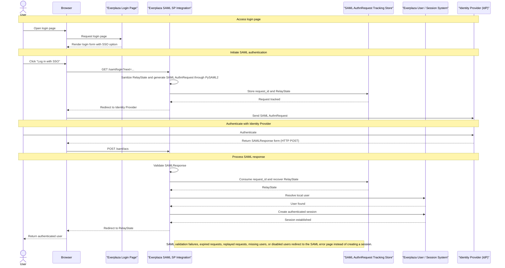
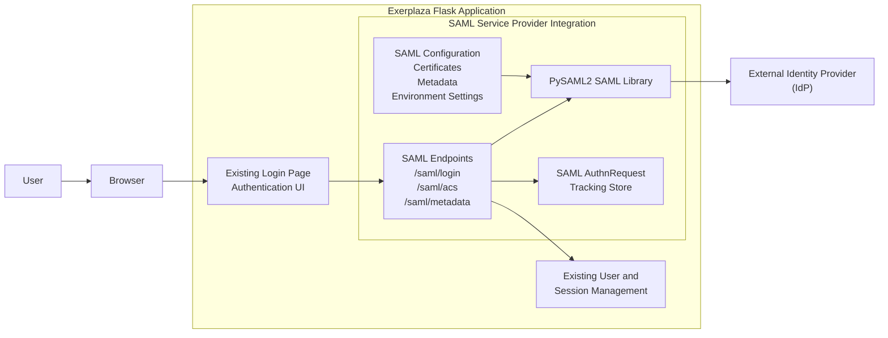

# Documentation

## Overview

This module introduces SAML-based Single Sign-On authentication capabilities into Exerplaza.

The implementation acts as a SAML Service Provider (SP) integrated directly into the existing Flask application using PySAML2. It allows users to authenticate through an external Identity Provider (IdP) while integrating with the existing user management and session mechanisms. The SAML login flow is exposed through the existing login page by adding an additional entry point that redirects users to the SAML authentication endpoint.

The current implementation provides:

- SAML authentication through a configured Identity Provider  
- Service Provider metadata generation  
- SAML authentication request generation  
- Assertion Consumer Service (ACS) processing  
- Integration with the existing user session management  
- Database-backed SAML authentication request lifecycle tracking  
- Replay protection mechanisms through single-use request consumption and expiration validation  
- Local certificate generation and SAML environment setup utilities for testing and deployment configuration  

The implementation currently supports a single configured Identity Provider and represents a complete SAML authentication flow integration within the current project scope.

The SAML configuration is loaded during application startup and is considered static during runtime. This ensures that all application workers operate using a consistent Service Provider configuration. Any changes to the SAML configuration require rebuilding or restarting the application environment.

## Current limitations

The current implementation demonstrates the complete SAML authentication flow and provides a functional basis for further production validation. Before production use, additional validation and hardening would be required, including:

- Additional security hardening and review  
- Extended handling of edge cases and failure scenarios  
- Validation against the target production Identity Provider environment  
- Additional deployment-specific testing and operational validation  

The current implementation is designed around a single configured Identity Provider. Support for multiple Identity Providers or federation scenarios is not included in the current scope.

Expired and unused authentication requests can be removed through the provided cleanup operation. The database does not automatically remove expired records; cleanup must be triggered by an external maintenance process or scheduled task.

## SAML Authentication Architecture 

The SAML authentication implementation introduces a Service Provider (SP) integration inside the existing Exerplaza Flask application. The integration extends the existing authentication flow by adding an external Identity Provider (IdP) authentication option while preserving the existing user and session management mechanisms.

The architecture consists of the following components:

- The existing Exerplaza authentication UI, which provides the entry point for SAML login.  
- The SAML Service Provider integration, which handles SAML endpoints and authentication flow coordination.  
- PySAML2, which provides SAML protocol handling and Service Provider functionality.  
- A database-backed AuthnRequest tracking store, which maintains authentication transaction state and provides replay protection.  
- The existing Exerplaza user and session management system, which remains responsible for application authentication state.  
- An external Identity Provider, which performs user authentication and returns SAML assertions.  

## SAML Authentication Flow


---


---

## Components

The SAML integration is composed of several components that work together to provide Service Provider functionality while integrating with the existing Exerplaza authentication system.

### mod_saml SAML Service Provider Integration

The `mod_saml` module acts as the application-level integration layer for SAML authentication inside Exerplaza.

It provides the Flask-based Service Provider functionality and coordinates the authentication flow between the existing application, PySAML2, the Identity Provider, and the existing user/session system.

It integrates:

- Flask SAML endpoints  
- PySAML2 protocol handling  
- AuthnRequest tracking  
- Existing user/session integration  

Responsibilities:

- Expose SAML-related HTTP endpoints  
- Coordinate SAML authentication request creation  
- Process incoming SAML responses from the Identity Provider  
- Manage SAML authentication transaction state  
- Validate authentication results before creating application sessions  
- Integrate authenticated users into the existing Exerplaza authentication flow  

The module contains the application-specific SAML logic, including:

- Route handling for SAML endpoints  
- SAML service-layer operations  
- Database-backed authentication request tracking  

Implemented endpoints:

- `/saml/login` - Initiates SAML authentication  
- `/saml/acs` - Assertion Consumer Service endpoint that receives SAML responses  
- `/saml/metadata` - Provides Service Provider metadata  
- `/saml/error` - Handles authentication failure responses  

---

### PySAML2 Service Provider

PySAML2 provides the underlying SAML protocol implementation used by the Service Provider integration.

Responsibilities:

- Generate SAML authentication requests  
- Process SAML responses from the Identity Provider  
- Validate SAML assertions  
- Generate Service Provider metadata  

PySAML2 is responsible for SAML protocol handling, while application-specific authentication state management and user integration remain handled by Exerplaza.

---

### SAML AuthnRequest Tracking Store

The SAML AuthnRequest tracking store maintains temporary authentication transaction state required to correlate requests generated by the Service Provider with responses returned by the Identity Provider.

Responsibilities:

- Store generated SAML request identifiers  
- Preserve RelayState during the authentication flow  
- Track authentication request expiration  
- Prevent replay attacks through single-use request consumption  

The tracking store is database-backed to ensure authentication transaction state remains consistent across multiple application workers.

This component represents temporary SAML authentication state and is separate from user sessions or application data.

---

### Existing User and Session Management

The existing Exerplaza user and session management remains responsible for application authentication state.

Responsibilities:

- Resolve users from SAML-provided identity attributes  
- Verify that users are allowed to authenticate  
- Create the authenticated application session  

The SAML integration extends the existing authentication system rather than replacing it.

---

### SAML Configuration and Environment Setup

The SAML configuration layer provides the runtime configuration required by the Service Provider integration.

It is responsible for preparing the SAML environment before authentication requests can be processed.

Responsibilities:

- Load Service Provider configuration  
- Resolve environment-based configuration values  
- Configure Identity Provider information  
- Provide certificates and private keys required for SAML communication  
- Generate and provide Service Provider metadata configuration  
- Validate SAML runtime settings during application startup  

The configuration layer is initialized when the Flask application starts and remains static during runtime. This ensures that all application workers operate using a consistent Service Provider configuration.

Changes to SAML configuration require rebuilding or restarting the application environment.

The configuration layer also contains utilities used for local certificate generation and SAML environment setup during development and deployment preparation.

---

## SAML Authentication Flow Details

The SAML authentication flow consists of several stages that connect the existing Exerplaza authentication system with the configured Identity Provider.

The mod_saml module coordinates the authentication flow while delegating SAML protocol handling to PySAML2 and application authentication state management to the existing Exerplaza user/session system.

### 1. Authentication initiation

The user starts authentication from the existing Exerplaza login page by selecting the SAML Single Sign-On option.

The request is handled by the /saml/login endpoint provided by the mod_saml module.

During this step:

- The requested post-login redirect target (RelayState) is validated.  
- A SAML AuthnRequest is generated through PySAML2 using the configured Service Provider settings.  
- The generated request identifier is stored in the AuthnRequest tracking store.  
- The user is redirected to the configured Identity Provider.  

The stored request identifier is later used to correlate the returned SAML response with the original authentication request.

At this stage, Exerplaza has created a pending authentication transaction, but no authenticated application session exists.

---

### 2. Identity Provider authentication

The Identity Provider receives the SAML AuthnRequest and performs user authentication.

The authentication method used at this stage is controlled by the Identity Provider and is outside the responsibility of Exerplaza.

After successful authentication, the Identity Provider generates a SAMLResponse containing the authenticated identity information and returns it through the Assertion Consumer Service endpoint.

---

### 3. Assertion Consumer Service processing

The /saml/acs endpoint receives the SAMLResponse and begins the response processing flow.

During this step:

The SAML response is retrieved from the incoming request.  
The response is parsed and validated through PySAML2.  
The authenticated identity attributes are extracted.  
The original AuthnRequest identifier (InResponseTo) is recovered from the SAML response.  
The corresponding authentication transaction is checked against the AuthnRequest tracking store.  

This stage validates that the response is a valid SAML response and that it references an authentication request previously created by Exerplaza.

The authentication transaction is not consumed during this stage.

---

### 4. Authentication transaction validation

The AuthnRequest tracking store provides protection against replayed authentication responses.

The request is validated and consumed through an atomic database operation.

When a valid request is found:

- The request is verified to exist.  
- The expiration timestamp is checked.  
- The request is verified to have not already been consumed.  
- The request is atomically marked as consumed.  
- The stored RelayState is recovered.  

Only after successful transaction validation can the authentication flow continue.

A previously consumed, expired, or unknown request is rejected and cannot create an application session.

---

### 5. User resolution and session creation

After successful SAML response validation and authentication transaction validation, the authenticated identity is mapped to an existing Exerplaza user.

The existing user/session system remains responsible for application authentication state.

During this step:

- The user is resolved from SAML-provided identity attributes.
- User restrictions are checked.
- The authenticated user is passed into the existing session mechanism.
- The application session is created using the existing Exerplaza authentication lifecycle.

The SAML integration does not create a separate authentication system. It acts as an external identity authentication layer that integrates with the existing user and session management.

---

### 6. Redirect completion

After successful authentication:

- The stored RelayState destination is validated.
- The user is redirected to the requested internal application location.
- The browser continues using the existing authenticated Exerplaza session.

If any previous stage fails, the authentication process is terminated and the user is redirected to the SAML error handling endpoint.

# Project Structure

The implementation is divided into separate modules according to responsibility.

Example structure:

```
saml/
|
├── routes/
│   └── Authentication endpoints
│
├── services/
│   └── SAML protocol logic
│
├── configuration/
│   └── SAML configuration management
│
├── templates/
│   └── Authentication error pages
│
└── database/
    └── Request tracking models
```

## Routes

Responsible for:

- starting authentication;
- receiving SAML responses;
- handling authentication errors.

---

## Services

Responsible for:

- interacting with PySAML2;
- creating and validating SAML messages;
- implementing authentication logic.

---

## Configuration

Responsible for:

- loading SAML settings;
- reading environment variables;
- generating PySAML2 configuration objects.

---

## Database

Responsible for:

- storing authentication request information;
- validating request lifecycle;
- preventing request reuse.

---

# Configuration

The SAML integration requires several configuration parameters.

These include:

## Service Provider information

Defines Exerplaza as a SAML Service Provider.

Examples:

- entity identifier;
- assertion consumer service URL;
- certificates.

---

## Identity Provider information

Defines the external authentication provider.

Examples:

- IdP metadata;
- entity identifier;
- certificates;
- endpoints.

---

## Environment variables

SAML-related settings are loaded through environment variables.

The required variables depend on the deployment environment.

Example:

```
SAML_ENTITY_ID=
SAML_ACS_URL=
SAML_METADATA_PATH=
SAML_CERT_PATH=
SAML_KEY_PATH=
```

---

# Security Considerations

## Persistent request tracking

The default PySAML2 request state handling relies on temporary internal storage.

This approach was not suitable for the Exerplaza deployment environment because multiple uWSGI workers may process different parts of the same authentication transaction.

To solve this issue, authentication requests are stored in the application database.

---

## Replay protection

Each SAML authentication request is associated with:

- a unique identifier;
- an expiration time;
- a consumption status.

A previously completed request cannot be reused.

---

## Validation

The implementation includes tests covering:

- invalid authentication responses;
- expired requests;
- invalid sessions;
- disabled users;
- unsafe redirects;
- authentication failures.

---

# Testing

## Automated tests

The implementation includes automated tests covering different parts of the authentication flow.

Tests include:

### Component tests

Validate individual components such as:

- configuration loading;
- route behaviour;
- helper functions.

---

### Behavioural tests

Validate interactions between components:

- request creation;
- database tracking;
- response validation;
- authentication flow behaviour.

---

## End-to-end testing

The complete authentication flow was tested using a local Keycloak Identity Provider.

The test validates:

1. Starting authentication.
2. Redirecting to the Identity Provider.
3. Completing authentication.
4. Returning the SAML response.
5. Validating the response.
6. Creating the application session.

---

# Setup

## Requirements

Before running the SAML integration, ensure that:

- the project environment is correctly configured;
- required dependencies are installed;
- database migrations are applied;
- certificates are generated.

---

## Identity Provider setup

A local Identity Provider can be configured using Keycloak.

The IdP must provide:

- metadata;
- authentication endpoints;
- certificates;
- user attributes.

---

## Certificates

The implementation requires certificates for SAML communication.

Generation and validation scripts are provided to simplify certificate management.

---

# Limitations

The current implementation is a functional prototype.

Known limitations:

- only one Identity Provider has been tested;
- production deployment requires additional validation;
- federation scenarios require further testing;
- a complete production security review has not been performed.

---

# Future Improvements

Possible future extensions include:

- support for multiple Identity Providers;
- federation discovery support;
- additional security testing;
- production deployment validation;
- improved monitoring and logging.

---

# Maintenance Notes

When modifying the SAML implementation, particular attention should be given to:

- request tracking logic;
- certificate management;
- Identity Provider configuration;
- authentication state handling.

Changes to these components should always be validated through automated tests and end-to-end authentication testing.
